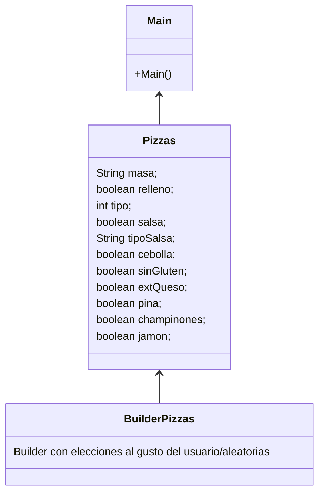
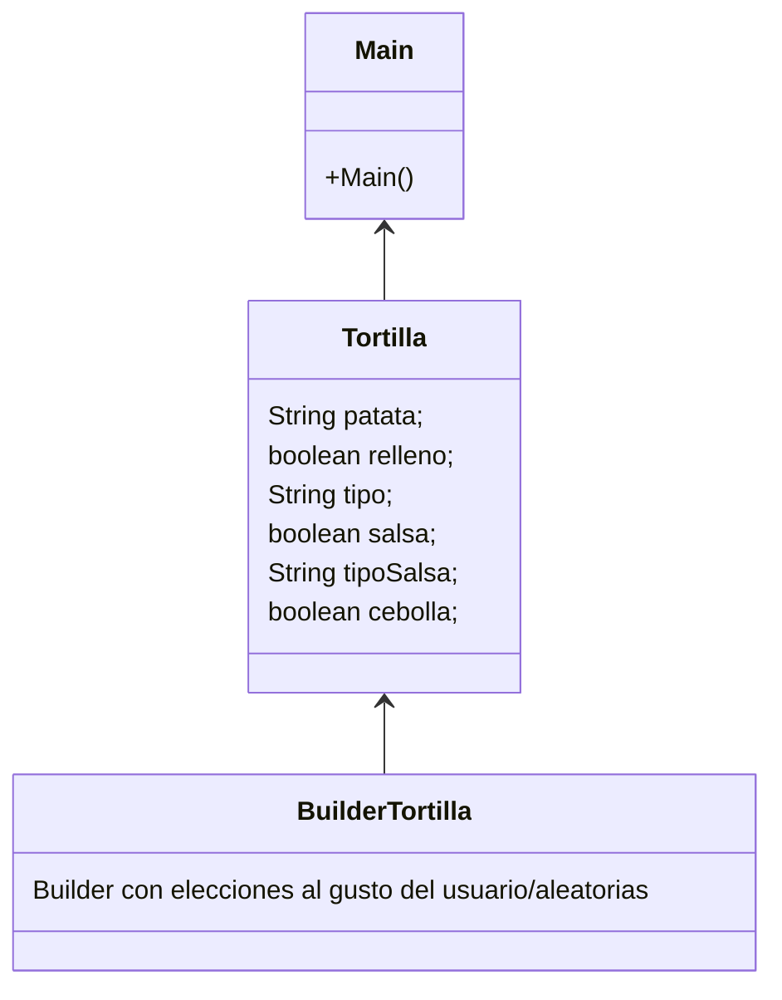

# PatronBuilder

¿Cual es la función de este patrón?

Permitirnos crear objetos complejos paso a paso.
En este caso una pizza con sus diferentes ingredientes.

¿Como es su Diagrama de clases? Realiza en el readme el diagrama

¿Podríamos combinarlo con el patrón Factory?

Sí. podríamos crear una Factory dentro del propio Patron Builder para complementarlos uno con el otro.
 
 
<h1>EXAMEN</h1>

¿Cual es la función del patrón builder? Pon ejemplo (que no sea Pizzas)
 

Permitirnos crear objetos complejos paso a paso.
En este caso usaremos como ejemplo una tortilla de patata, el patrón builder nos permitirá crear un objeto Tortilla el cual puede tener
una infinidad de atributos de una forma mucho más sencilla pues en caso de querer crearla desde 0 tendríamos que añadir todos estos
de forma individual pero gracias al builder podremos especificar solo los que deseemos.

 
¿Como es su Diagrama de clases de este ejemplo que has hecho? Realiza en el readme el diagrama

 
¿Podríamos combinarlo con el patrón Factory? Explícalo con algo de código como lo harías
 

El patrón Builder se utiliza para construir objetos complejos paso a paso, mientras que el patrón Factory se utiliza para crear objetos de diferentes tipos. Por ende, en Java, se pueden combinar ambos patrones para crear objetos complejos de diferentes tipos.

Para combinar el patrón Builder con el patrón Factory, podríamos utilizar una interfaz de Factory que permita crear instancias del constructor apropiado del Builder según el tipo de objeto que deseas construir.
 
public interface Tortilla { 
    public float Tortilla(); 
    public int Tipo(); 
} 
 
public class BuilderFactory { 
    public static Tortilla getTortilla(){ 
    } 
} 
 
Con Tortilla definimos los métodos para construír nuestro objeto mientras que BuilerFactory actuaría de Factory para crear las diferentes instancias.
