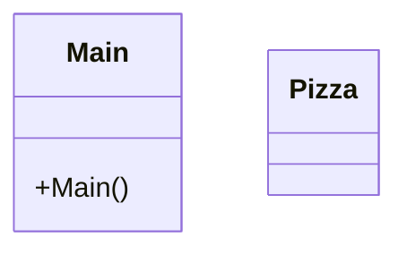

# PatronBuilder

¿Cual es la función de este patrón?

Permitirnos crear objetos complejos paso a paso.

¿Como es su Diagrama de clases? Realiza en el readme el diagrama

¿Podríamos combinarlo con el patrón Factory?

Sí. podríamos crear una Factory dentro del propio Patron Builder para complementarlos uno con el otro.
