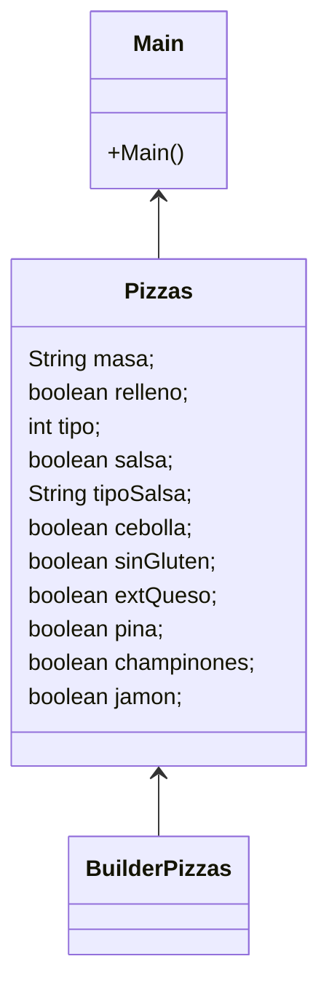
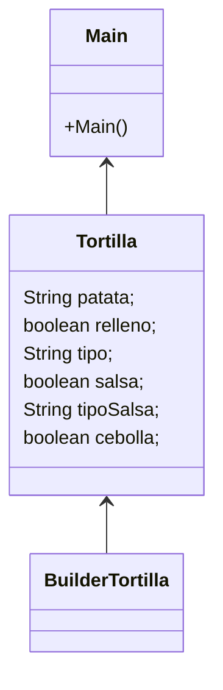

# PatronBuilder

¿Cual es la función de este patrón?

Permitirnos crear objetos complejos paso a paso.
En este caso una pizza con sus diferentes ingredientes.

¿Como es su Diagrama de clases? Realiza en el readme el diagrama

¿Podríamos combinarlo con el patrón Factory?

Sí. podríamos crear una Factory dentro del propio Patron Builder para complementarlos uno con el otro.

EXAMEN

¿Cual es la función del patrón builder? Pon ejemplo (que no sea Pizzas)

Permitirnos crear objetos complejos paso a paso.
En este caso usaremos como ejemplo una tortilla de patata, el patrón builder nos permitirá crear un objeto Tortilla el cual puede tener
una infinidad de atributos de una forma mucho más sencilla pues en caso de querer crearla desde 0 tendríamos que añadir todos estos
de forma individual pero gracias al builder podremos especificar solo los que deseemos.

¿Como es su Diagrama de clases de este ejemplo que has hecho? Realiza en el readme el diagrama

¿Podríamos combinarlo con el patrón Factory? Explícalo con algo de código como lo harías
